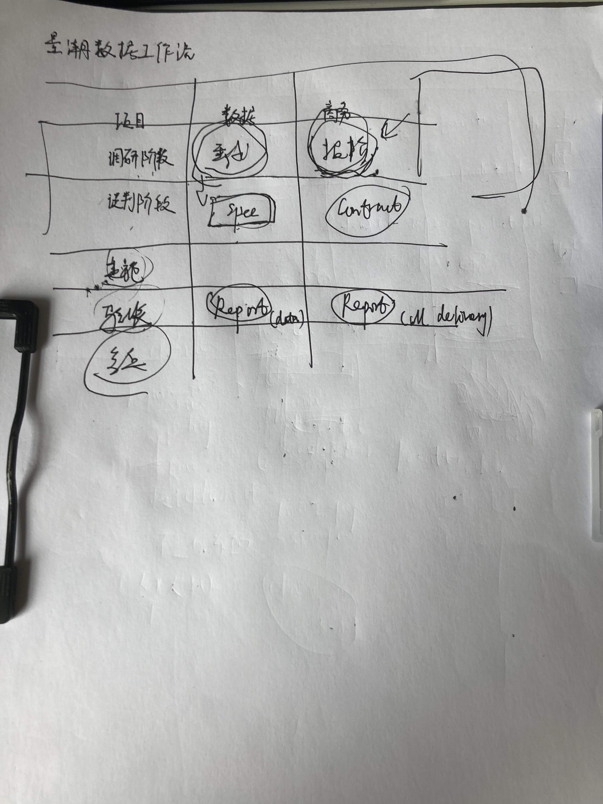

# 2026-07-27_量潮数据APP

图片为量潮数据工作流程图，分为项目调研谈判、谈判阶段、实施阶段、验收阶段、复盘阶段五个阶段。每个阶段有对应的关键文档，如谈判阶段有"报价""合同""SPICE"等，实施阶段有"进度汇报""工程进度汇报"等，验收阶段有"Report (day)""Report (all delivery)"等。该图与文档中量潮数据项目制服务流程内容相关，直观呈现各阶段及对应文档。

我们的那个量潮数据提供的是一个项目制的服务，然后我们目前是主要是把项目分成 5 个阶段，调研谈判实施验收复盘。然后呢，每个阶段都会有对应的文档，作为承载这个流程的一个验收结果的一个方式。

对于数据来说，在在在前面这个跟客户进行调研接洽这个阶段，那么数据的话，我们要梳理需求，形成数据需求文档，然后呢，根据这个出一个初步的报价单。

嗯，谈判阶段我们主要是帮助客户去说梳理这个数据规格书，梳理对应的合同，然后签过合同过之后呢，然后就可以开始实施了。然后实施呢，中间就是会有一些过程的进度的汇报啊，然后包括工程的进度汇报，然后也包括我们在整，就是进度汇报，再然后就是我们的验收阶段。然后验收这个阶段主要就会完整的去介绍一下我们的数据的情况，然后也会有交付清单，然后呢最后复盘这个就是我们。发现问题啊，在技术在，在技术上发管理上发现问题啊，然后总结成复盘报告

我觉得现在整个流程是完整的，理想的，各个节点可以追溯，但是可能会有些意想不到小bug，这些问题可以在实际使用上，慢慢发现，再去进行优化

用户旅程梳理：

旅程1：接到客户需求，录入数据需求

**场景** 客户口头讲一堆零散需求，商务整理录入系统，方便后续技术落地。

**痛点** 不清楚该收集哪些信息；客户要求碎片化怕漏关键内容反复返工；客户说不清楚需求时不知道怎么引导。

产品提供的功能

- 结构化需求录入表单：覆盖常见字段（数据来源、采集频率等）
- 模板化引导：根据数据来源（电商/社交媒体/政务数据）切换不同字段模板
- 口语化选项：选项使用非技术语言

旅程 2：定义数据规格（契约 + 蓝图）

**场景** 需求定下来后，和客户说好数据交付要求，以及出问题该怎么处理。 

**痛点** 技术每次都要从头开始思考各个异常情况；没法全面跟客户解释各类故障场景。

产品提供的功能

- 蓝图异常处理预设清单：列出常见异常类型（反爬、字段缺失、数据量异常等），下方提供处理策略下拉选项（重试3次/跳过/告警/自动适配），商务经理只需要“勾选”
- 契约-蓝图对应关系可视化：每个异常处理策略关联到对应的契约指标（如“缺失率超过30%”对应“告警”）

旅程 3：拿着蓝图去和客户谈判确认

**场景** 商务带着数据蓝图和客户沟通，双方把需求、标准、异常处理全部对齐。 

**痛点** 不懂技术，很难跟客户讲明白专业内容；客户提出疑问没有参考依据；修改条款不容易留痕，容易产生纠纷。

产品提供的功能

- 蓝图展示模式：非技术可读模式，将技术语言转化为非技术可理解语言
- 条款批注功能：客户有疑问的条款可添加批注，备注修改意见或解释说明，支持现场修改并重新生成版本
- 版本对比功能：修改前后版本自动保存，可对比差异，避免口头约定导致的扯皮
- 一键导出蓝图：生成 PDF 蓝图文档，可直接发给客户确认

旅程 4：查看执行进度

**场景** 项目跑起来之后，客户经常过来询问进度。 

**痛点** 一有问题就得跑去问技术；很难一眼看出项目进度和有没有卡住。

产品提供的功能

- 项目看板页面：展示所有项目列表，每个项目以卡片形式展示名称、当前状态（进行中/已完成/待启动）、进度百分比、最新更新时间
- 进度可视化：进度百分比 + 已完成/总数 + 预计完成时间，让商务经理和客户都能一目了然
- 异常标注：出现异常时，项目卡片以红色边框或图标高亮，并在进度旁标注“异常：1条”，点击可查看详情
- 状态时间轴：展示项目从需求录入到当前状态的时间节点，让非技术人员直观了解项目“怎么一步步走到现在的”

旅程 5：查看交付记录

**场景** 交付期间或者交付结束后，应对客户查询交付内容、核对数据质量。 

**痛点** 客户问往期交付内容很难快速查到；客户质疑数据质量拿不出凭证；不清楚每次交付客户是否验收通过。

产品提供的功能

- 交付记录列表：按时间倒序展示每次交付的记录，每条记录显示交付时间、交付物名称、文件大小、格式
- 交付详情页面：点击交付记录进入详情，包含：交付物清单及下载链接、数据质量报告（契约指标达成情况）、处理日志概要（“什么时候发生了什么”）、客户验收状态（待验收/已通过/需修改）
- 质量报告可视化：契约指标达成情况以进度条或仪表盘形式展示（如“缺失率：5%（目标≤30%）✅”），客户一眼就能看懂数据质量是否达标
- 重新交付入口：若客户需修改，商务经理可点击“重新交付”发起新版本
