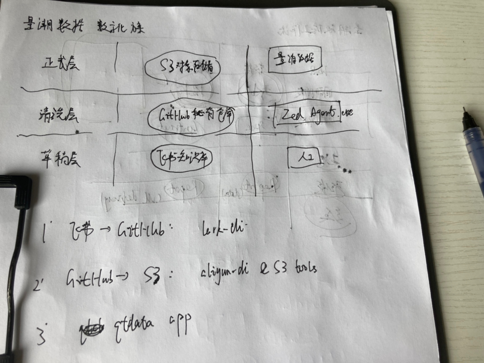

# 2026-07-28_量潮数据

图片是一张手写图示，展示了量潮数据数字化的步骤。图中分为正式会、消灾会、平灾会三部分，分别对应S3对象存储、GitHub私有仓库、飞书知识库。右侧标注有量潮实战、Zed Agent use、人工等内容。下方有三个步骤说明：1. 飞书→GitHub；2. GitHub→S3；3. gitdata.cpp。该图与文档中介绍的量潮数据数字化流程相关，直观呈现了各步骤及对应内容。

以数据湖的思想，以数字资产为主要操作对象，把整个系统分为三步。

第一步也是最关键的一步，是通过飞书命令行工具，把飞书知识库的资料下载到他自有仓库之中，并且将人工处理变成 AI 处理。这个步骤是最繁琐、最混乱、最复杂的部分。当这一步完成以后，后续的数字化进程就可以事半功倍。

第二步是搭建一个从 GitHub 私有仓库到 S3 对象存储的结构，这。这个步骤相对比较简单，只要 GitHub 私有仓库的资产管理结构严谨一致，那么上传到 S3 让它变成生产可用是比较容易的。即使是有各种各样的问题，也可以先在 AI 辅助下调整，整理干净之后再上传。

第三步是为上线到 S3 的数据搭建一个服务器，那么它就可以正式地以一个应用的形式对外访问。

第一步没有什么技术架构，难点主要是人工操作

。  
  
难点主要在第二步的对象存储治理，因为考虑到历史也有过几个版本，对象存储的命名规则需要审。

然后基本原则是：  
  
1. 制定一套最新的对象存储命名规范。  
2. 根据规范进行标记：符合该规范的标 1，不符合的标 0。  
3. 处理标 0 的部分：根据其内容与最新规范匹配，看能否塞进最新的框架里。如果能塞进去就塞进去；如果塞不到，就看看如何增加现有的框架。尽可能地把本地的 GitHub 私有仓库体系合并到我们现有的系统之中。使用 DVS 去引用对象存储的内容，这样就可以保持实际上的一致性。同时，GitHub 和 S3 又能够互为备份，GitHub 定期去提交一些更新到 S3 上就可以。

目前我们的存储桶大体可以分为两类：  
1. 私有仓库：需要手工维护。  
2. 公开仓库：对应平台代码，这部分是自动维护的。  
  
搭建一个内部一次性整理数据往业务系统提交的流程之后，后面的就容易了。

各个子系统的一致性是一个难题。基本原则是尽可能地单向流动。当流动到下一级更正式的资源后，就尽可能地把旧的资源（即不规范、原始格式较为混乱的资源）移除，并对正式的资源进行多道保护。并且反复用业务活动来验证这个资产是否帮助到了业务活动，以此来看资产治理的有效性如何。

对象存储命名规范：

量潮： qtdata-provider（平台数据）

量潮科技：qtdata-private（业务数据）

Step3 通过自动化程序把 private 的数据导入 provider  

其他资源组和存储桶逐步废弃，集中到“量潮”和“量潮科技”两个资源组，对应两个 GitHub 组织。

就这一套数字化方案的核心点，其实不是写写平台，而是把所有的数据全部以一个一个github私有仓库的形式，然后存Markdown和JSON  

为什么我前几个月都在干这个事情呢？就是因为：

1. 先把数据转成了一个容易被机器读的格式
2. 然后再写平台就比较自然  

所以说你们在做项目的过程之中，渐进式的标准化、规范化资料，然后套个壳上线。

具体步骤：

1. 把这个 GitHub 私有仓库往对象存储里同步一份
2. 网站就可以上线了  

然后用平台上线资料结合邮件去发送，这样整个就会有序很多了  

我们的飞书到 GitHub 的搬迁，这一步先找一个典型客户开始，把所有的资料拉出来。围绕这些资料去建立资产审计方案，包括报价单、合同、数据规格书，以及跟客户的原始记录等，该有的都要有。  

我们尝试从这些资料出发去复盘，看看能不能找到这些客户之中的问题。比如说，已知问题能不能找到原因，或者我们能不能发现新问题。秘书处呢，主要就是看这些思考有没有被积累下来。

我在让产品经理改进这个平台的原型，刚才突然意识到一件事情：

平台的原型套上客户的数据本身就可以直接发给客户去看了。

这样我们也可以通过这个过程去验证平台的原型是不是可用的。如果可用的话，开发正式平台的成本就会大幅降低  

也就是说，平台研发过程中产生的原型产品，它本身就可以作为我们提高这个业务沟通效率的工具。

然后，又在业务当中验证，就可以把这个上生产，然后形成一个更平滑的这个平台的升级过程  

无论是哪一个，确定的一点是：我们现在是在自举，就是用我们自己的方法论去数字化我们自己的业务  

这样子的话，就可以给团队一个比较明确的预期：

在项目的间隙，就以我们自己的这个项目作为一个目标，然后去调节整个团队的节奏

昨天说的做平台、做课程等各种各样零散的任务，都可以装在这个主线里面，这样就有一个更清晰的交付目标了

这个本身都可以作为一个典型案例去吸引企业客户  
  
  

对，所以你看我的日志里面画的这个图，就是：

1. 从飞书这一层提到GitHub这一层，就是为了让它首先能够被分析、被整理。

2. 利用这个步骤把破碎的流程整合成一个完整的体系。

3. 然后才能够把它上到对象存储，把非结构化数据变成结构化

这个就是把数据湖的思想直接套到了我们的资产治理的这个场景上面
