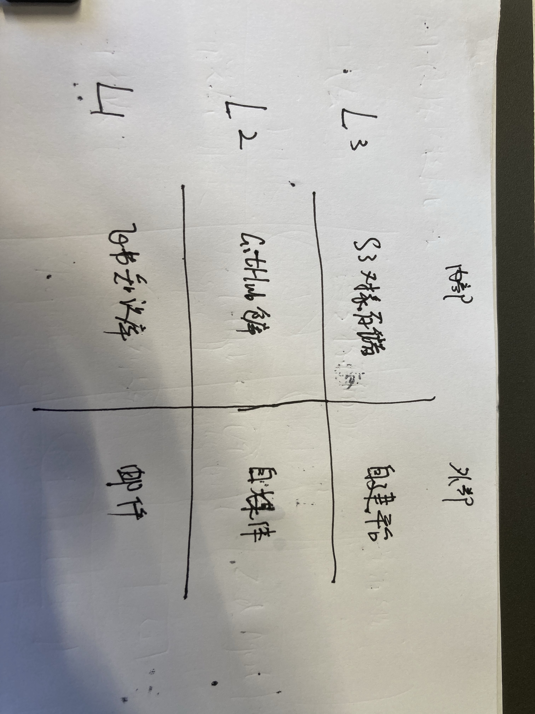

# 2026-07-29_量潮数据

这张手绘表格用于梳理数字化等级相关的规范内容，整体结构分为内部、外部两大横向分类，以及L3、L2、L1三个纵向等级分类。横向标注的"内部"对应L3等级下的内容为"S3对象存储"，L2等级下的内容为"Gitlab仓库"，L1等级下的内容为"飞书云文档"；横向标注的"外部"对应L3等级下的内容为"自建平台"，L2等级下的内容为"自媒体库"，L1等级下的内容为"邮件"，和上下文提到的"对昨天的规范进行系统梳理，加入外部交付渠道"的内容相呼应。

数字化等级：对昨天的规范进行系统梳理，加入外部交付渠道。
